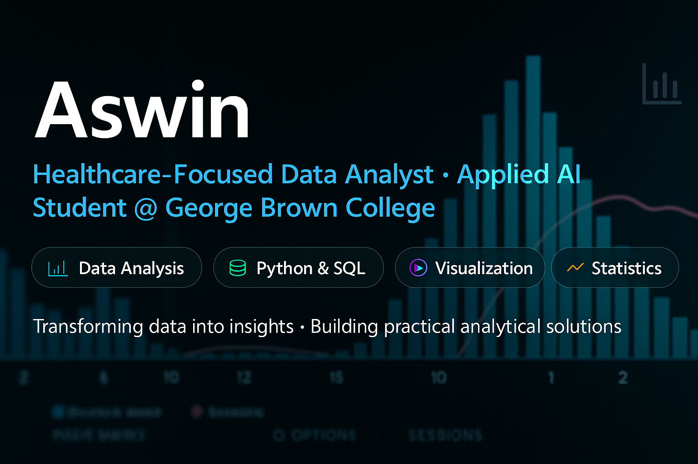

  

### 🎓 Applied AI Student @ George Brown College  
### 💼 Aspiring Data Analyst | Healthcare Focus  
### 🧠 AI • Machine Learning • Data Analytics • Python • SQL

### 🔧 Tech Stack

---

## 🧑‍💻 About Me  
I'm an Applied AI Solutions student at **George Brown College** with a background in **Data Science and Mechanical Engineering**.  
I’m passionate about using **AI and analytics to improve healthcare accessibility**, especially for people with disabilities — a mission inspired by my own lived experience.

I aim to build **practical, real-world solutions** and secure a stable **9–5 data/AI role** in the Canadian healthcare or government sector.

---

## 🚀 Technical Skills  

### 🐍 Programming  
- Python (pandas, NumPy, scikit-learn, matplotlib, seaborn)
- SQL (MySQL, SQL Server)
- Jupyter Notebook  
- Streamlit

### 📊 Analytics & BI  
- Power BI  
- Tableau (Public profile below)  
- Data Cleaning & Visualization  
- Dashboard Building

### 🤖 Machine Learning  
- Classification & Regression  
- Clustering  
- Model Evaluation Metrics  
- Feature Engineering  
- NLP Basics  

### 🗄 Data Management  
- SQL Databases  
- MongoDB  
- ETL Pipelines  
- Data Modeling

---

## 📂 Featured Projects  

### 🔬 **1. Healthcare: Diabetes Prediction (ML Classification)**  
End-to-end ML pipeline using scikit-learn including EDA, feature selection, model comparison, and evaluation.  
📁 [GitHub Repository](https://github.com/Aswinab97/Healthcare-diabetes-classification)

### 📊 **2. Toronto/Ontario Healthcare Data Analysis (EDA + Dashboard)**  
Exploring public government healthcare datasets with visual insights.  
📁 [GitHub Repository](https://github.com/Aswinab97/toronto_er_analysis)

### 🤖 **3. AI-Enhanced Assistive Tool for Disability Support**  
Applying machine learning and simple rule-based AI to create accessible support systems.  
📁 *Repo coming soon*

### 📈 **4. Power BI / Tableau Dashboards**  
Interactive dashboards focusing on healthcare KPIs and trends.  
🔗 [Tableau Public](https://public.tableau.com/app/profile/aswin.a.b/vizzes)

### 🗃 **5. SQL Portfolio (Joins, CTEs, Window Functions)**  
Complex SQL queries using realistic healthcare/government data.  
📁 *Repo coming soon*

---

## 🎯 Current Focus  
- Building a strong portfolio for data/AI roles  
- Improving English communication & interview skills  
- Working on hands-on AI/ML projects through the Applied AI Solutions program  
- Strengthening SQL, Python, and dashboard development  

---

## 📬 Connect With Me  
📍 Toronto, Canada  
### 📬 Connect With Me

---

## 🛠 Tools & Technologies  

---

## 🌱 What I'm Learning  
- Machine learning model deployment  
- Advanced SQL for analytics  
- Healthcare data standards  
- Data modeling best practices  
- Communication for technical interviews  

---

## 📊 GitHub Stats

<table>
<tr>
<td>

</td>

<td>

</td>

<td>

</td>
</tr>
</table>

---
## ⚡ Fun Fact  
I believe the most powerful AI model is teamwork — and good chai during coding sessions.  
